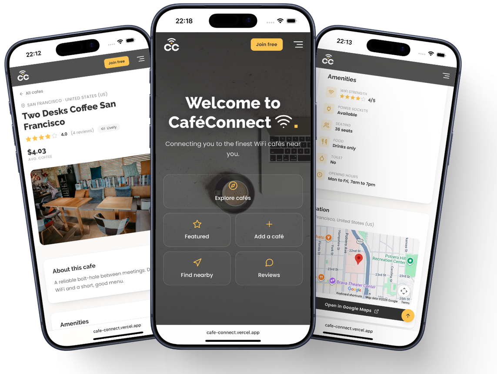
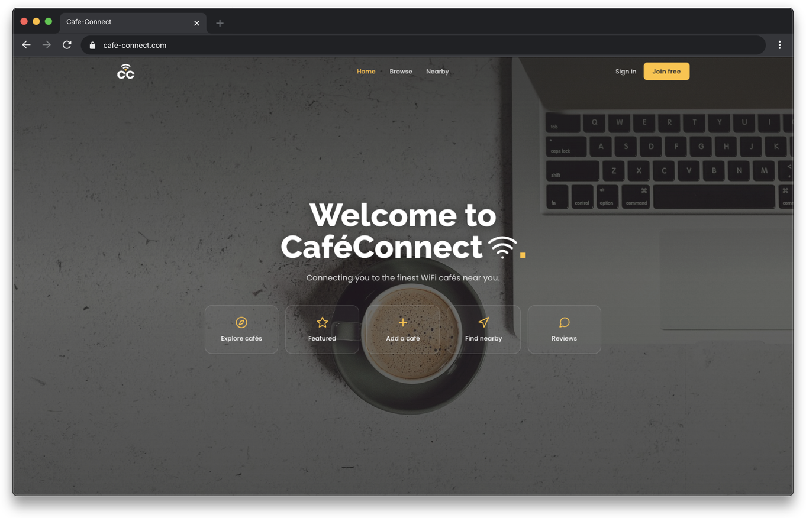
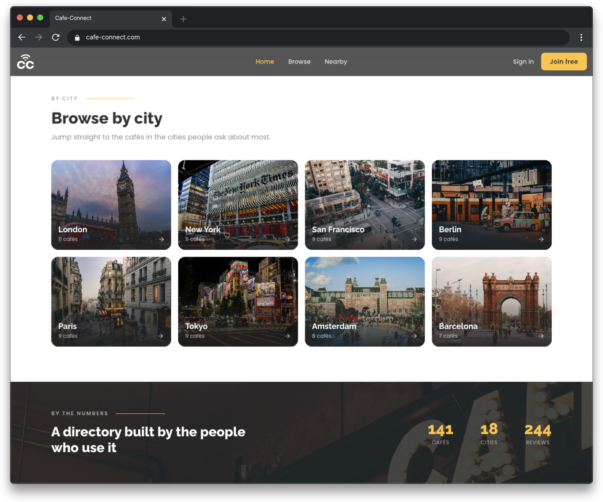
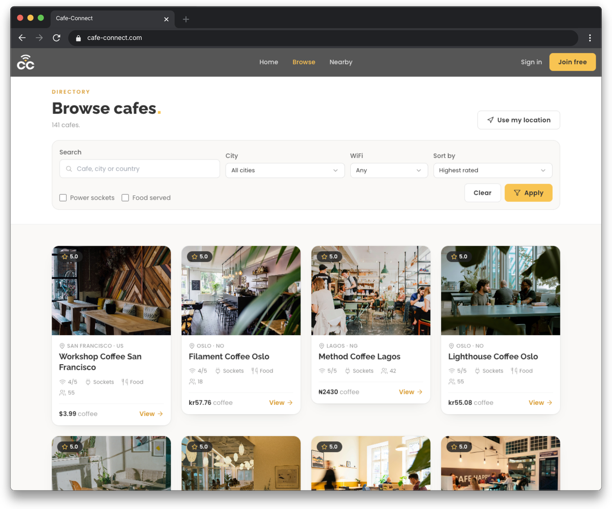
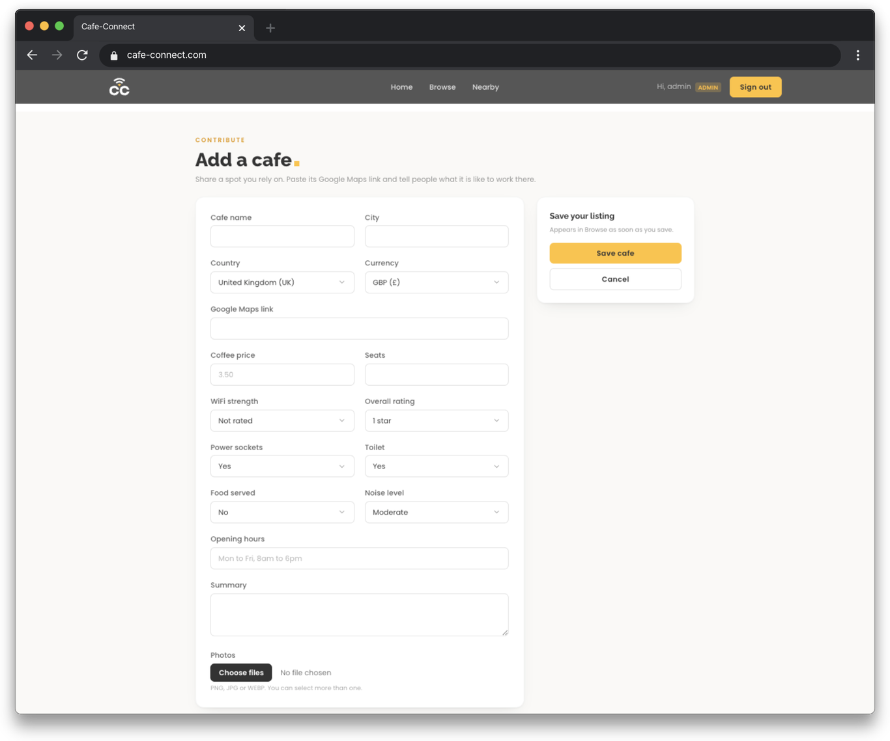
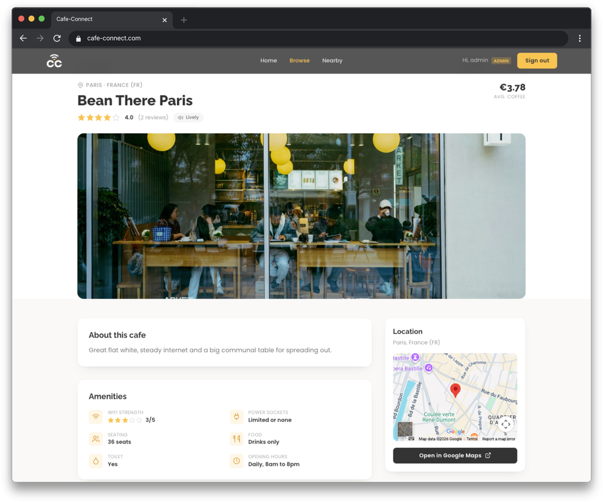
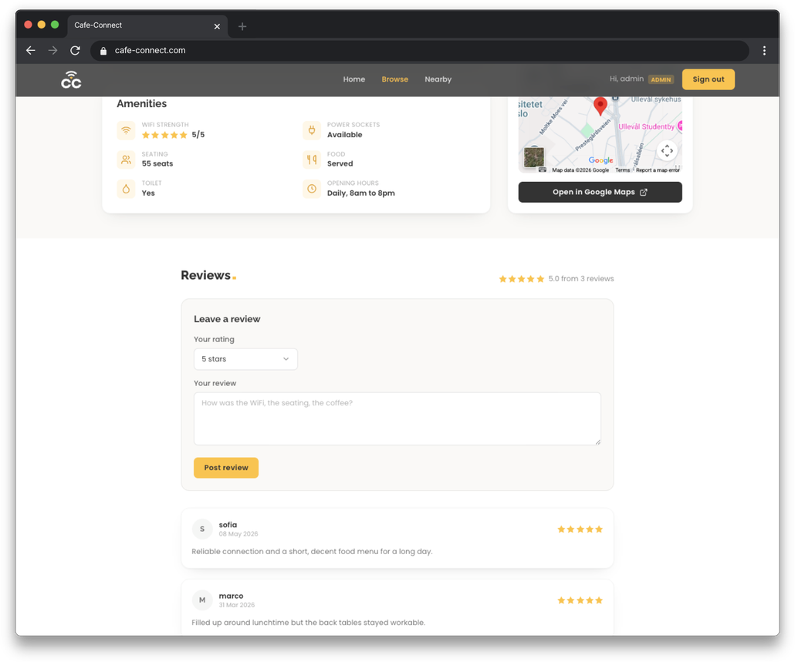

# CafeConnect

A curated directory of cafés worth working from.

CafeConnect profiles each café on the things that decide whether you can settle in for a few hours: wifi strength, power sockets, seating, noise, the price of a coffee and opening hours. Members add the places they rely on, rate them and leave reviews. It is built as two surfaces over one set of data: a polished, mobile-first web app, and a JSON REST API.

**Live demo: [cafe-connect.vercel.app](https://cafe-connect.vercel.app)**

Browsing is open to everyone. To try the signed-in features, adding a café and leaving a review, sign in with `member@cafeconnect.app` / `Member@1234`. The demo data resets nightly.

## Screenshots

   
  CafeConnect on mobile: home, a listing, and amenities at a glance

   
  The landing page

   
  Browse by city, with the directory's running totals

<table>
  <tr>
    <td width="50%">
       
      The directory, with search, filters and sort
    </td>
    <td width="50%">
       
      Contributing a café
    </td>
  </tr>
</table>

<table>
  <tr>
    <td width="50%">
       
      A listing in full
    </td>
    <td width="50%">
       
      Ratings and reviews on every café
    </td>
  </tr>
</table>

## What it offers

Browse and sort the directory, or search for cafés near you using your location. Open a café for its full profile, photos, facilities and member reviews. Sign in to add a café of your own and leave ratings and reviews. Administrators curate the directory and upload the photography.

## Design

The look is premium and deliberately restrained: a warm amber accent over charcoal and cream, generous spacing, and typography carrying most of the weight. The interface is mobile-first and scales up cleanly to desktop. The palette is amber (`#ffc451`), charcoal (`#222222`) and cream (`#faf9f7`); display type is Raleway, body type Poppins.

## Approach

The app is server-rendered with Flask and Jinja, styled with Tailwind compiled through the Tailwind CLI, with no heavy single-page framework, so pages paint fast and a little vanilla JavaScript handles the map and location search. Authentication is split by surface: the web app uses server-side sessions, while the API is stateless and uses signed JWT bearer tokens. In production it runs on PostgreSQL with object storage for images and a nightly data reset; locally it runs on SQLite with no external services required.

## Stack

| Layer | Technology |
| --- | --- |
| Language | Python |
| Web framework | Flask, Jinja |
| Data layer | SQLAlchemy |
| Web auth | Flask-Login (server sessions) |
| API auth | PyJWT (stateless bearer tokens) |
| Validation | marshmallow (API), WTForms (web) |
| Styling | Tailwind CSS, compiled via the Tailwind CLI |
| Client | Vanilla JavaScript |
| Database | PostgreSQL in production, SQLite in development |
| Image storage | Supabase Storage |
| Rate limiting | Flask-Limiter |
| Hosting | Vercel |

## API

A full REST API sits alongside the web app, exposing the café data over JSON with token authentication, filtering, search and distance queries. See [API.md](API.md) for the endpoint reference, authentication, testing and integration examples.

## The code

This repository is a showcase of CafeConnect, a personal project. The application source is kept private and is not open source, but it can be shared for review on request.
